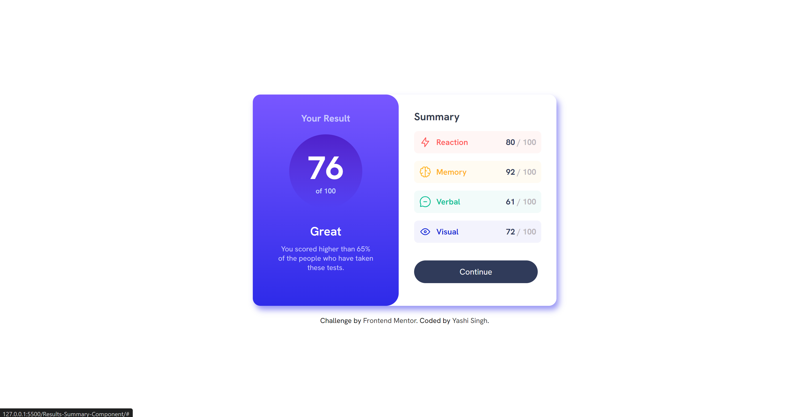
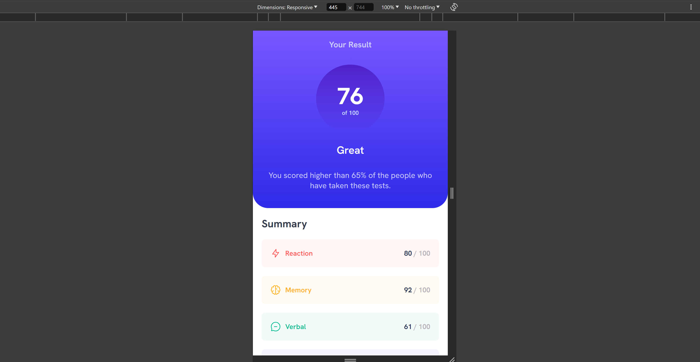

# Frontend Mentor - Results summary component solution

This is a solution to the [Results summary component challenge on Frontend Mentor](https://www.frontendmentor.io/challenges/results-summary-component-CE_K6s0maV). Frontend Mentor challenges help you improve your coding skills by building realistic projects. 

## Table of contents

- [Overview](#overview)
  - [The challenge](#the-challenge)
  - [Screenshot](#screenshot)
  - [Links](#links)
- [My process](#my-process)
  - [Built with](#built-with)
  - [What I learned](#what-i-learned)
- [Author](#author)

## Overview

### The challenge

Hey there! I build a results summary component using just HTML and CSS. The key is to make sure it looks great on any screen size, so it's super important to nail that responsive design. Oh, and don't forget those hover effects—they really make things pop! Ready to create a slick, interactive interface? Let's do this!

### Screenshot

Desktop Preview

Mobile Preview

### Links

- Live Site URL: [live site ](https://results-summary-component-by-yashi.netlify.app/)

## My process

### Built with

- Semantic HTML5 markup
- CSS custom properties
- Flexbox
- Mobile-first workflow
- External dependencies:
      - Google Fonts: Imported 'Hanken Grotesk' font via URL in CSS for typography.
      - Local Images: Utilized  tags with local image sources (image/icon-reaction.svg, etc.) for graphical content.

### What I learned

Working on this project has been a great learning experience, and here are some key takeaways:

#### Semantic HTML5 Markup
 
Working on this project has been a great learning experience, and here are some key takeaways:

            <section>
                <h4>Semantic HTML5 Markup</h4>
                
Using semantic elements like &lt;section&gt;, &lt;div&gt;, &lt;h3&gt;, and &lt;p&gt; helped me structure the content meaningfully.

                <pre><code>&lt;section class="summary"&gt;
  &lt;h3&gt;Summary&lt;/h3&gt;
  &lt;!-- Other semantic elements used here --&gt;
&lt;/section&gt;
                </code></pre>
            </section>
            <section>
                <h4>CSS Custom Properties (Variables)</h4>
                
CSS custom properties (--variables) proved invaluable for maintaining consistent styling across the project.

                <pre><code>:root {
  --light-red: hsl(0, 100%, 67%);
  --orangey-yellow: hsl(39, 100%, 56%);
  /* Define other variables */
}

.result .great {
  color: var(--orangey-yellow);
}
                </code></pre>
            </section>
            <section>
                <h4>Flexbox for Responsive Layouts</h4>
                
Flexbox (display: flex) was crucial for creating flexible layouts, especially within the .container and .result sections.

                <pre><code>.container {
  display: flex;
  flex-direction: column;
  justify-content: center;
  align-items: center;
}

.result {
  flex: 1;
  text-align: center;
}
                </code></pre>
            </section>
            <section>
                <h4>Media Queries for Mobile-First Design</h4>
                
Implementing media queries (@media (max-width: 630px)) ensured the design was responsive and optimized for various screen sizes.

                <pre><code>@media (max-width: 630px) {
  .result .score {
    width: 35vw;
    height: 35vw;
  }
  
  /* Other responsive adjustments */
}
                </code></pre>
            </section>
            <section>
                <h4>External Dependencies Management</h4>
                
Integrating Google Fonts and local images (&lt;img&gt; tags) required understanding how to link external resources and optimize loading times.

                <pre><code>&lt;link rel="stylesheet" href="https://fonts.googleapis.com/css2?family=Hanken+Grotesk:ital,wght@0,100..900;1,100..900&display=swap"&gt;

&lt;img src="image/icon-reaction.svg" alt="Reaction Icon" width="24" height="24"&gt;
                </code></pre>
            </section>
        </section>
    </section>

## Author

- LinkedIn - [Yashi Singh](https://www.linkedin.com/in/yashi-singh-b4143a246)
- Frontend Mentor - [@Yashi-Singh-1](https://www.frontendmentor.io/profile/Yashi-Singh-1)
